<h1 align="center">dOS</h1>

	Research OS written from scratch 
	Retro look, new code  
	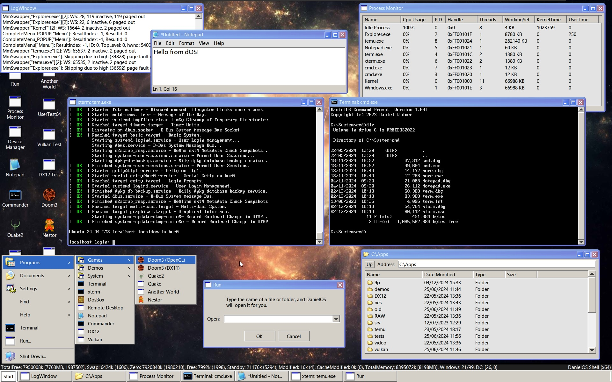

	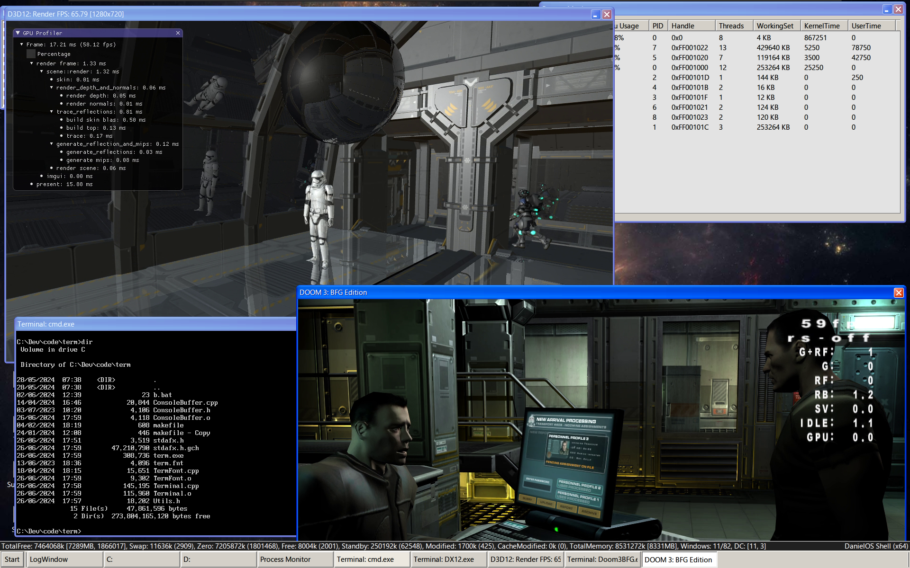

	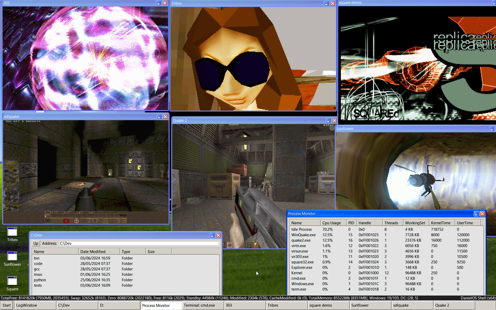

***

## OS Features
+ [Modern 64-bit Kernel](#kernel-features)
+ [Graphical User Interface](#graphical-user-interface)
+ [3D Graphics Stack (DirectX 12, Vulkan, OpenGL)](#graphics-and-compute-apis)
+ [Compute and Machine Learning Stack (CUDA)](#graphics-and-compute-apis)
+ Network Stack (TCP, UDP, IPv4/IPv6, DHCP)
+ USB Stack (USB 3.0, USB 2.0)
+ Audio Stack (Server, Mixer)
+ [Win32 Subsystem (Run Windows applications!)](#win32-subsystem)
+ [Virtualization Hypervisor (Type-2)](#virtualization-hypervisor)
+ [Terminal and Command-Line Utilities](#terminal-and-command-line)
+ FAT32 (R/W), NTFS (R/W), ISO 9660

<h4 style="margin-bottom:0px"><a href="#screenshots">Videos and Screenshots</a></h4>
<h4><a href="#hardware">Supported Hardware</a></h4>
***
## Kernel Features
+ Preemptive multithreaded kernel
+ Multi-core and hyperthreading support (SMP, SMT)
+ Virtual memory
	- Swap and copy-on-write support
	- Mapped files and shared memory
	- Automatic background paging (swapper)
+ Process and memory protection (kernel and user mode)
+ Exception handling (SEH, custom, try-catch)
+ Virtual file systems with symbolic links
	- Infinite file system cache
	- Pipes and interprocess communication (IPC)
	- Mountable and networked file systems
	- DeviceFS, NetworkFS, PipeFS, RamDisk
+ Extensible synchronization primitives
	- Spinlock, Mutex, Futex, Event, Semaphore
+ Deferred and asynchronous execution
	- Deferred Procedure Calls (DPC)
	- Asynchronous Procedure Calls (APC)
+ PE executables and DLLs
	- Loadable drivers and plugins
+ WOW64: 32-bit processes on 64-bit systems
+ Kernel profiling
+ Event tracing (ETW)
+ Debugging
	- Breakpoints and stack traces
	- Symbols and source-level debugging (PDB)
	- Debugger support (LLDB)

***

## Graphical User Interface
+ Fast window manager
+ DPI scaling
+ Shell and File Explorer
+ Native UI controls and menus
+ Optimized rendering (AVX-512, AVX, SSE)
+ Transparent windows
+ Window regions
+ Themes

	<b>Transparent windows with complex regions</b> 
	

	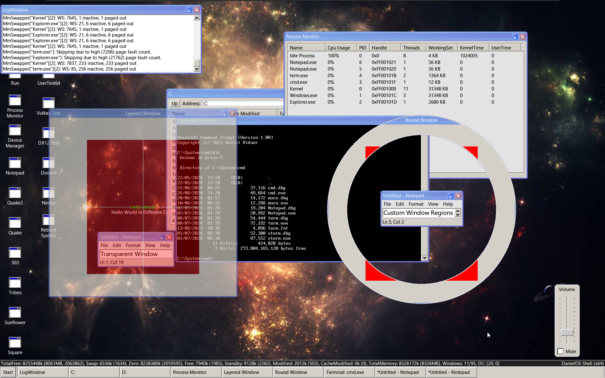

***

## Graphics and Compute APIs

**Graphics**
+ DirectX 12 + Raytracing
+ Vulkan 1.3 + Raytracing
+ DirectX 11
+ OpenGL 4.6+

**Compute and Machine Learning**
+ CUDA 12.9 (Native / Driver API)
+ CUDA Runtime (CUDART)
+ cuBLAS
+ cuDNN

	<b>DirectX 12 (Raytracing)</b> 
	

	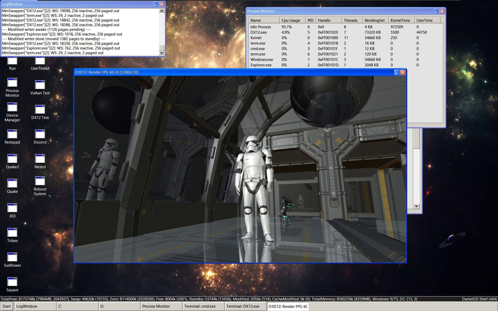

	<b>Doom 3: BFG Edition (OpenGL)</b> 
	

	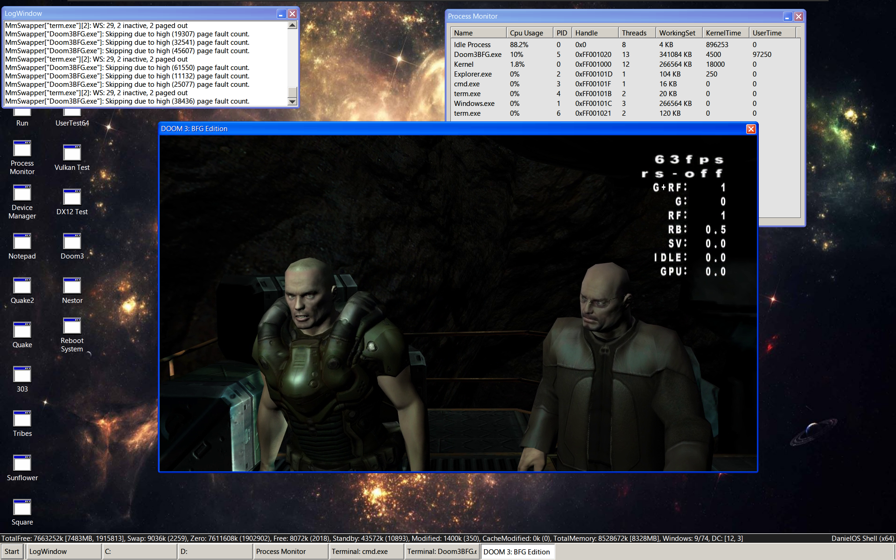
	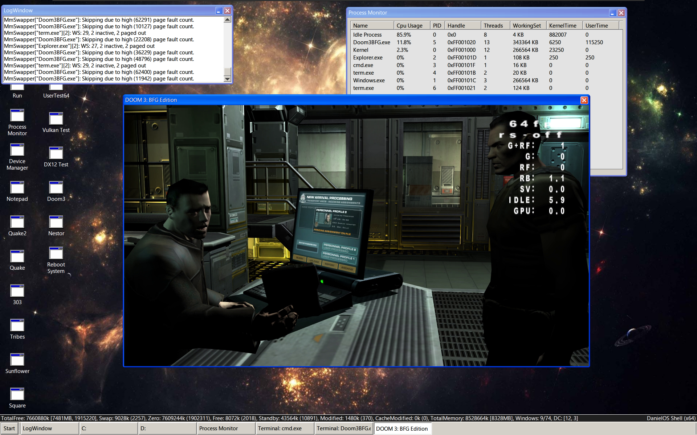

***

## Win32 Subsystem
+ Run Windows applications
	- Applications run on both dOS and Windows
	- Most dOS apps are standard Windows binaries
+ Native performance
	- Win32 API calls translated directly to native APIs
+ Supported APIs
	- UI: Win32 controls (partial)
	- 3D: DirectX, Vulkan, OpenGL
	- Compute / ML: CUDA
	- Audio: XAudio2, WinMM
	- Network: Winsock2
	- Event tracing (ETW)
+ Win32 and Win64 support

***

## Virtualization Hypervisor
+ Type-2 hypervisor
+ Intel VMX and AMD SVM support
+ Emulated hardware
	- APIC, PIC, PIT, CMOS
	- IDE controllers
	- Intel E1000/E1000e
	- VirtIO (disk, console)
+ KVM-like interface
+ Virtualized Ubuntu Linux (similar to WSL 2)
+ Supported guests: Linux, Windows, FreeDOS
	

	<b>Ubuntu 64-bit VM running on dOS</b> 
	

	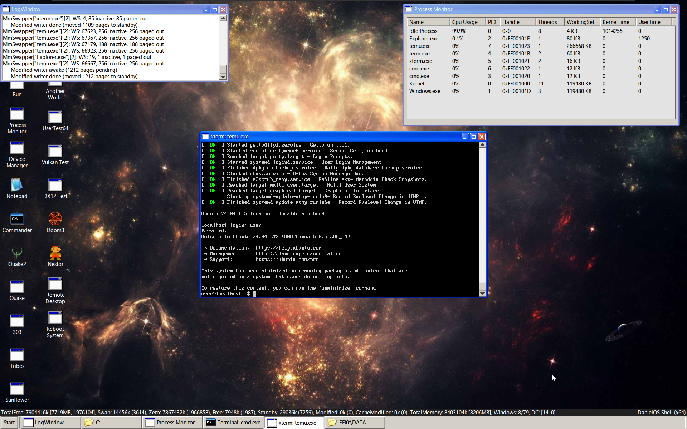

	<b>Windows VM running on dOS</b> 
	

	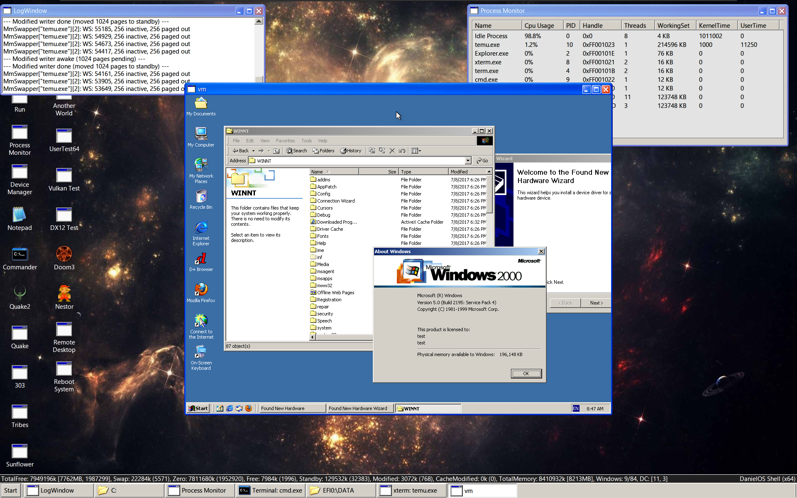

***

## Terminal and Command Line
+ Terminals
	- VT100 support
	- Console attachments
+ Command-line utilities
	- Cmd.exe and core utilities
	- Pipes
	- Batch files
+ Development tools
	- Clang, GCC, Make, NMAKE
	- NASM, YASM, MASM
	- C# Native AOT
	- Python 3
	- LLDB debugger
	- Remote debugging with VS Code (LLDB)
	

	<b>Development tools 
	dOS compiling itself, Python 3, C#</b> 
	

	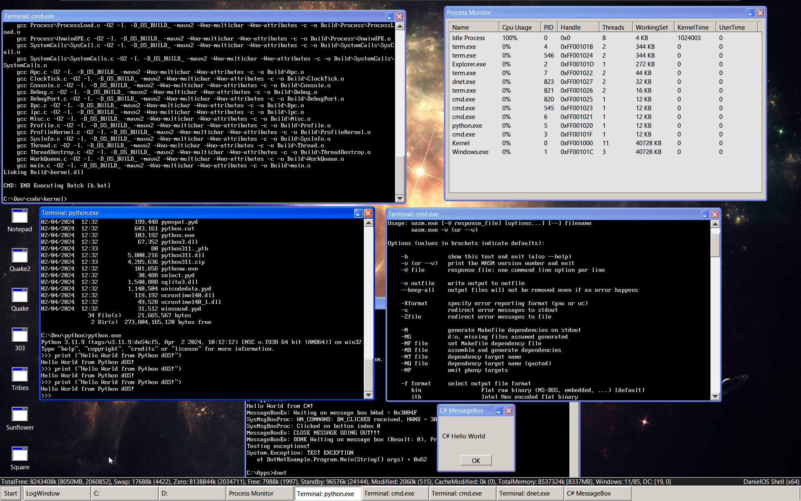

***

<h2 id="hardware">Supported Hardware</h2>
+ CPU: x64, x86
+ Bus: PCI, MSI, MSI-X
+ Boot: UEFI, BIOS, Network (PXE/TFTP)
+ Disk: NVMe, AHCI, IDE
+ USB: xHCI (3.0), EHCI (2.0)
+ Network
	- Realtek (8169/8125)
	- Intel (E1000/E1000e)
	- Broadcom (BCM5722D)
+ Sound: Intel HDA, Ensoniq ES1371
+ Hypervisor: Intel VMX, AMD SVM

	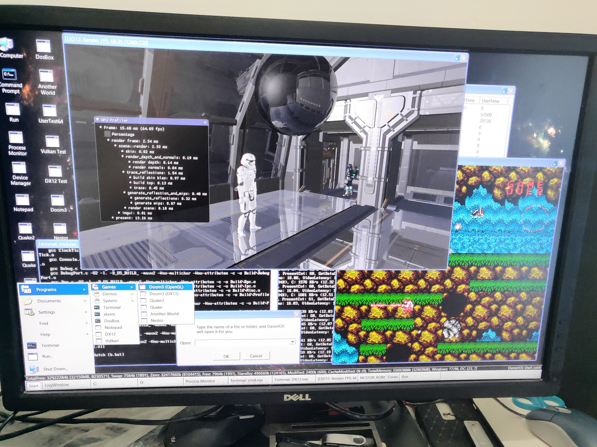

	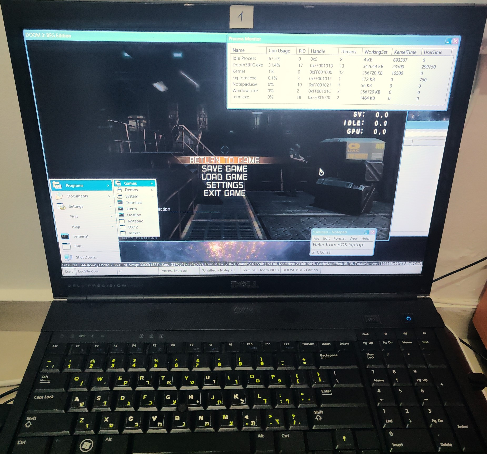
	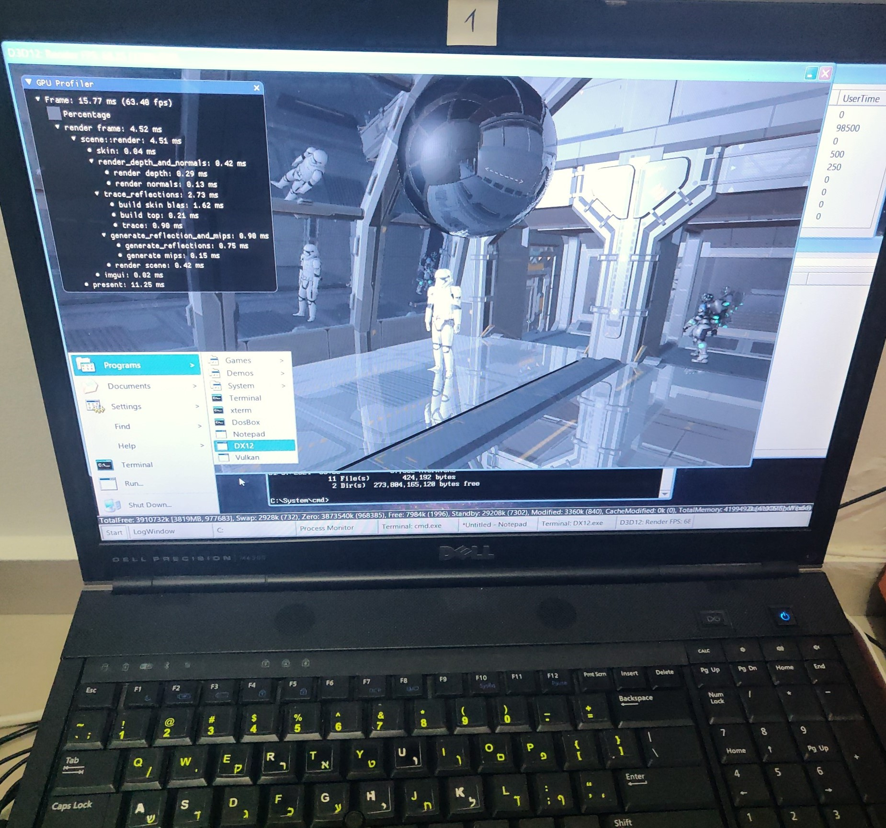

***

<h2 align="center" style="margin-bottom:2px" id="screenshots"><b>Videos and Screenshots</b></h2>

***

	<b>DirectX 12 Raytracing</b> 
	  

	<b>Doom 3: BFG Edition</b> 
	  

	<b>Demos</b> 
	  

	<b>Self-hosting (compiling itself)</b> 
	  

***

	
	  
	
	  
	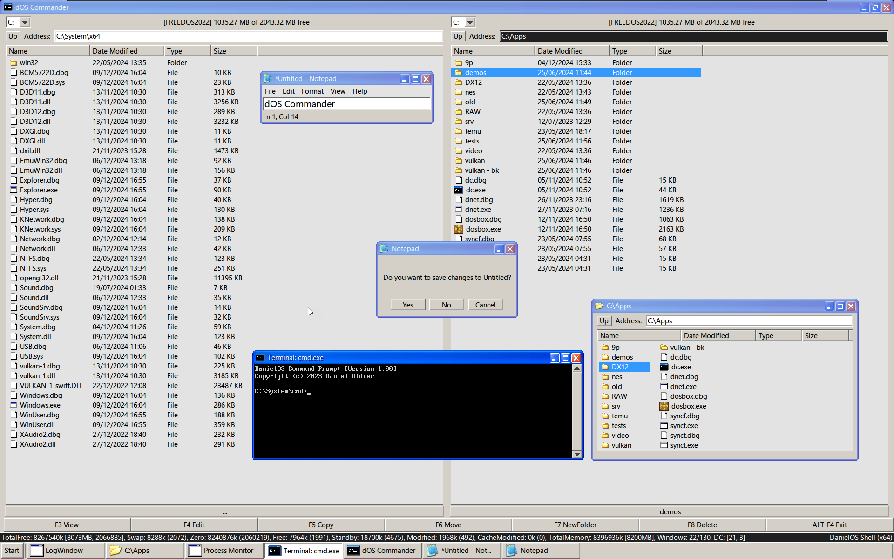
	  
	
	  
	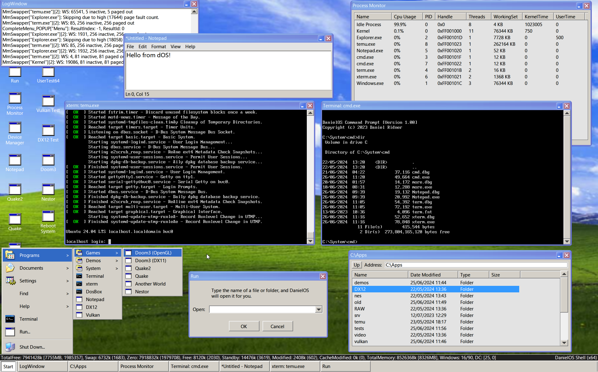

[(&uarr; TOP &uarr;)](#top)
