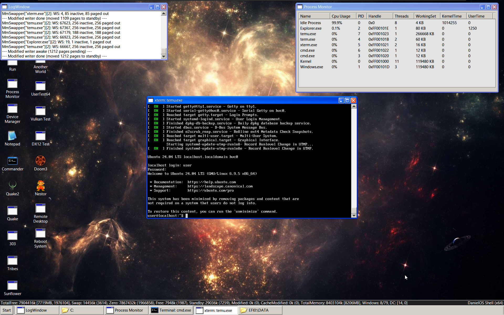

<h1 align="center">dOS</h1>

	Research OS written from scratch 
	Retro look, new code  
	

	

	

***

## OS Features
+ [Modern 64-bit Kernel](#kernel-features)
+ [Graphical User Interface](#graphical-user-interface)
+ [3D Graphics stack (DirectX 12, Vulkan, OpenGL)](#3d-graphics-apis)
+ Network stack (TCP, UDP, IP, DHCP)
+ USB stack (USB 3.0, USB 2.0)
+ Audio stack (Server, Mixer)
+ [Win32 Subsystem (Run Windows applications!)](#win32-subsystem)
+ [Virtualization Hypervisor (Type-2)](#virtualization-hypervisor)
+ [Terminal and Command Line Utilities](#terminal-and-command-line)
+ FAT32 and NTFS  

<h4 style="margin-bottom:0px"><a href="#hardware">Supported Hardware</a></h4>
<h4><a href="#screenshots">Screenshots and Videos</a></h4>
***
## Kernel Features
+ Pre-emptive multithreaded kernel
+ Multi-core with hyperthreading (SMP, SMT)
+ Virtual Memory
	- Swap and copy-on-write support
	- Mapped files and shared memory
	- Automatic background paging (swapper)
+ Process and memory protection (Kernel, User)
	- Exception Handling (try-catch)
+ Virtual file systems with symbolic links
	- Infinite file system cache
	- Pipes and interprocess communication (IPC)
	- Mountable and networked file systems
	- DeviceFS, NetworkFS, PipeFS, RamDisk
+ Extensible synchronization primitives
	- Spinlock, Mutex, Futex, Event, Semaphore
+ Asynchronous multiprocessing
	- Deferred Procedure Calls (DPC)
	- Asynchronous Procedure Calls (APC)
+ PE executables and DLLs
	- Loadable drivers and plugins
+ WOW64: Running 32bit processes on 64bit systems
+ Kernel Profiling
+ Debugging
	- Breakpoints and stack traces
	- Symbols and source level debugging (PDB)
	- Debugger support (LLDB)

***

## Graphical User Interface
+ Fast Window Manager
+ Shell and File Explorer
+ Native UI controls and menus
+ Optimized AVX/SSE drawing
+ Transparent Windows
+ Window Regions
+ Themes

	<b>Transparent Windows with Complex Regions</b> 
	

	

***

## 3D Graphics APIs
+ DirectX 12 + Raytracing
+ DirectX 11
+ Vulkan
+ OpenGL

	<b>DirectX 12 (Raytracing)</b> 
	

	

	<b>Doom 3: BFG (OpenGL)</b> 
	

	
	

***

## Win32 Subsystem
+ Run Windows applications
	- Apps work on dOS and Windows
	- Most dOS apps are standard Windows apps!
+ Native performance
	- Win32 syscalls translated to native APIs
+ Supported APIs
	- UI: Win32 controls (partial)
	- 3D: DirectX, Vulkan, OpenGL
	- Audio: XAudio2
	- Network: Winsock2
+ Win32 and Win64 support

***

## Virtualization Hypervisor
+ Type-2 Hypervisor
+ Emulated HW
	- APIC, PIC, PIT, CMOS
	- IDE Controllers
	- Intel E1000 Network
	- VirtIO (Disk, Console)
+ KVM like interface
+ Virtualized Ubuntu Linux (ala WSL2)
+ Supported OS: Linux, Windows, FreeDOS
	

	<b>dOS running Ubuntu 64bit</b> 
	

	

	<b>dOS running Windows</b> 
	

	

***

## Terminal and Command Line
+ Terminals
	- VT100 support
	- Console attachments
+ Command line utilities
	- Cmd.exe + Base Utils
	- Pipes
	- Batch files
+ Development Tools
	- GCC, MAKE, NASM/YASM
	- C# Native AOT
	- Python 3
	- clang, lldb
	- Remote debugging with VS Code (LLDB)
	

	<b>Development Tools 
	dOS compiling itself, Python 3, C#</b> 
	

	

***

<h2 id="hardware">Supported Hardware</h2>
+ CPU: x64 / x86
+ PCI, MSI, MSI-X
+ Disk: AHCI, IDE
+ USB: XHCI (3.0), EHCI (2.0)
+ Network: Intel E1000, Broadcom (BCM5722D)
+ Sound: Intel HDA, Ensoniq ES3171
+ Hypervisor: Intel VMX

	

	
	

***
<h2 align="center" id="screenshots">Screenshots and Videos</h2>
***

[(&#11105; TOP &#11105;)](#top)
